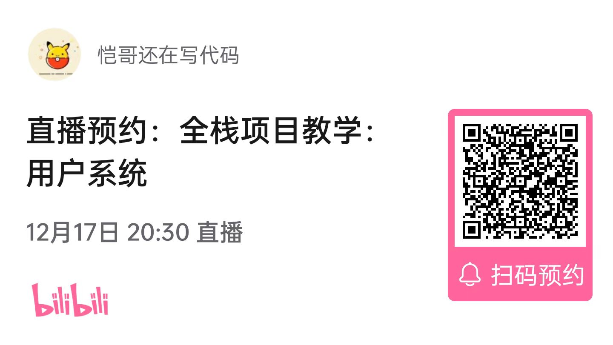

# fullstack-project

真全栈项目，适合前端进阶及转方向使用。项目包括前端、后端、Web3 最新技术栈，大杂烩，技术一锅端。

另外不是网上那些各种仿 xxx 的简单项目，尤其是后端会包括很多东西，学完直接上手做后端项目完全没问题。

教学全免费，在 B 站直播：https://space.bilibili.com/171185383 ，大家可以关注直播时间。

作者四年前端经验，之前在中大厂基础架构组任职，主攻工程化相关领域，目前在某 Web3 公司任职全栈工程师。

## 最新直播时间

大家可以 B 站扫码预约，教学文档稍后上传。

## 视频及相关资料

- [项目初始化](https://www.bilibili.com/video/BV1JA41197Z4/?spm_id_from=333.999.0.0&vd_source=364fc2418dd63e22bb78bf58fc2b962f)
  - [Next.js 文档](https://nextjs.org/)
  - [Nest.js 文档](https://docs.nestjs.com/first-steps)
  - [React-query 文档](https://react-query-v3.tanstack.com/overview)
  - [Vanilla-extract 文档](https://vanilla-extract.style/documentation/getting-started)
